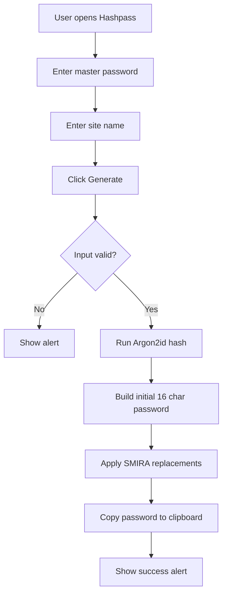
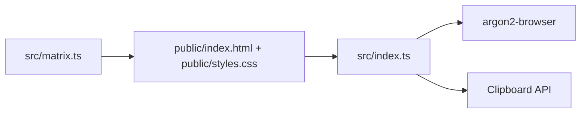
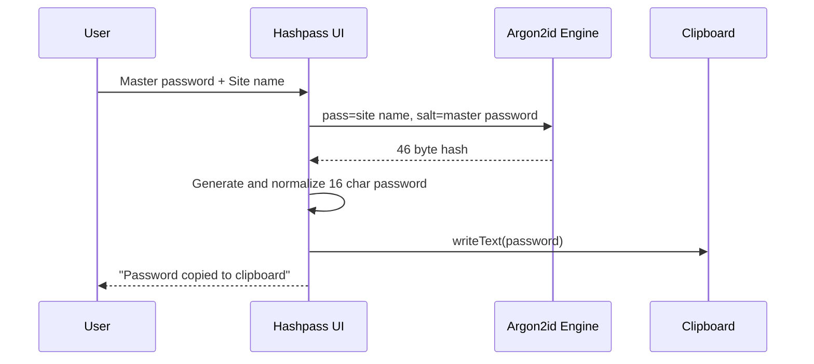

# Hashpass 🔐

I built Hashpass as a simple password calculator for daily use.
You enter a master password and a site name, and Hashpass generates the same strong 16 character password every time for that pair.

> No passwords are stored.
> Everything runs in your browser.

## Live Website

- App: https://konseptt.github.io/Hashpass/
- Portfolio website: https://syllabuscal.ranjansharma.info.np

## Why Hashpass

Traditional password managers keep vault data.
Hashpass takes a different path and derives passwords on demand.

It uses:
- Argon2id from `argon2-browser`
- Site name as input password
- Master password as salt
- A deterministic post processing step to enforce mixed character classes

## How it works

### Password generation flow



### App structure



### Input to output diagram



## Tech stack

- TypeScript
- Webpack
- Argon2 Browser
- HTML + CSS

## Local development

```bash
npm install
npm run dev
```

Then open the dev server URL shown in your terminal.

## Production build

```bash
npm run predeploy
```

## Notes

- Minimum master password length is 8
- Site name is required
- Output length is 16 characters
- Character set includes lowercase, uppercase, numbers, and symbols `!@#$%^&*`

## License

MIT
